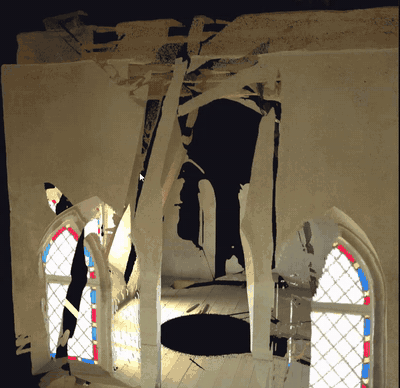
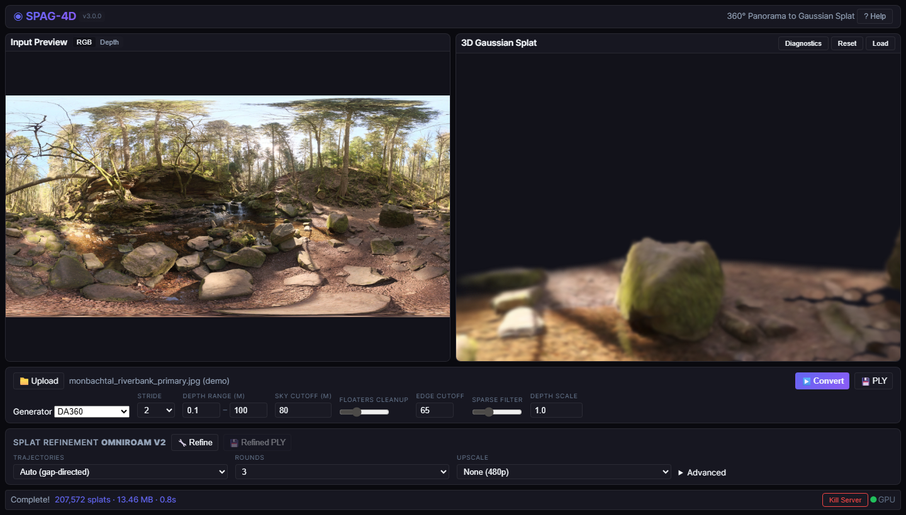
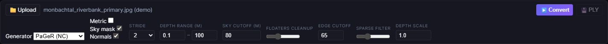
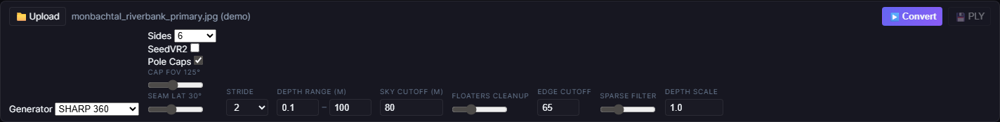

# SPAG-4D

Convert 360° panoramic photos into explorable 3D Gaussian Splat scenes.

SPAG-4D takes an equirectangular panorama and turns it into a 3D Gaussian Splat using one of **four** generator backends. Three are depth-based (**DA360**, **DAP**, **PaGeR**) and project a depth map into Gaussians via spherical geometry; the fourth (**SHARP 360**) uses Apple's [SHARP](https://github.com/apple/ml-sharp) model to predict Gaussians directly from perspective face crops, with DA360 depth alignment for inter-face consistency.

Optional refinement fills disocclusion holes — areas behind foreground objects the single camera never saw — using novel-view generation from [OmniRoam](https://github.com/yuhengliu02/OmniRoam) (default), with optional [SeedVR2](https://github.com/TencentARC/SeedVR) video upscaling. A higher-quality alternative, [ArtiFixer3D](https://github.com/nv-tlabs/ArtiFixer) (NVIDIA SIL, 14B generative repair in WSL2/Docker), can be enabled as an optional backend — see [Refinement](#refinement).

<p align="center">
  
</p>

<p align="center"><em>A PaGeR splat of a bell-tower interior, explored in the built-in viewer.</em></p>

---

## Quick Start (Windows)

> Requires an NVIDIA GPU (6 GB+ VRAM for DA360/DAP, 8 GB+ for SHARP 360, 12 GB+ for PaGeR, 48 GB for OmniRoam refinement), [Git](https://git-scm.com/downloads), and ~30 GB disk space. The optional **ArtiFixer3D** refine backend additionally needs WSL2 + Docker and ~140 GB disk (see [Refinement](#refinement)).

1. Download and extract the SPAG-4D release `.zip`.
2. Double-click **`install.bat`** and wait for "Installation Complete!" Near the end it offers an optional **ArtiFixer3D** backend setup — press Enter to skip it (it's advanced and not needed for the core app).
3. Double-click **`run.bat`**.
4. Your browser opens to **http://localhost:7860** with a demo panorama loaded. Pick a generator and hit **Convert**.

See [INSTALL.md](INSTALL.md) for the full walkthrough and troubleshooting.

<p align="center">
  
</p>

The web UI shows the source panorama (left) and the live 3D splat (right). Left-click to orbit, right-click to pan, scroll to zoom. Before your first conversion the viewer plays a short demo clip; it's replaced by your splat as soon as a conversion finishes.

---

## Generators

| Generator | How it works | Speed | Quality | VRAM | License |
|-----------|--------------|-------|---------|------|---------|
| **DA360** (default) | DA360 depth + SPAG spherical projection | ~2 s | Good, seamless poles | ~2 GB | Commercial-OK |
| **DAP** | DAP metric depth + SPAG projection | ~3 s | Good, metric scale | ~3 GB | Commercial-OK |
| **PaGeR** | DA3 cubemap depth + learned sky/normals + SPAG projection | ~15 s | Strongest outdoor depth | ~12 GB | **Non-commercial** |
| **SHARP 360** | Per-face SHARP prediction + DA360 alignment + merge | ~30 s | Highest per-face detail | ~8 GB | **Non-commercial** |

DA360 and DAP are the commercial-safe defaults. PaGeR and SHARP 360 use research weights with non-commercial licenses (see [License](#license)).

### DA360 / DAP / PaGeR (depth-based)

```
360° equirectangular panorama
  → Depth estimation (DA360, DAP, or PaGeR)
  → Scene analysis: auto depth range, sky cutoff, orbit radius
  → Spherical projection: depth × ray_direction = 3D Gaussian positions
  → Colors sampled directly from source pixels (sRGB)
  → Edge clipping, floater removal, sparse-region pruning
  → Standard PLY export
```

Each pixel becomes one Gaussian (at stride 1) or every Nth pixel (stride 2, 4, …). No face stitching, no seam artifacts. **PaGeR** additionally emits a learned **sky mask** (excludes sky from the depth-range fit) and world-frame **surface normals** (sharper grazing-angle clipping); indoor/outdoor is auto-detected by a CLIP router.

### SHARP 360 (ML-based)

```
360° equirectangular panorama
  → Extract N perspective horizon faces + nadir/zenith pole caps
  → Optional SeedVR2 upscale per face
  → Apple SHARP prediction per face (Gaussians straight from the image)
  → Hard Voronoi clipping (horizon faces by azimuth, caps by polar cone)
  → DA360 depth alignment (smooth grid scale field for inter-face consistency)
  → Rotate each face into the world frame + merge
  → Global scale restore + PLY export
```

SHARP predicts Gaussians directly from images — no separate depth model. The DA360 alignment makes faces agree on scale at their boundaries. **Pole-cap faces** (looking straight down/up) fill the holes the horizon ring leaves at the nadir and zenith, and the horizon/cap seam is tunable (see [SHARP 360 settings](#sharp-360-settings)).

### UniSHARP 360 (native ERP, optional)

A `sharp360` backend that runs [Insta360 UniSHARP](https://github.com/Insta360-Research-Team/UniSHARP) on the **whole equirectangular panorama at once** (`--camera panorama`) instead of decomposing it into cubemap faces — no face seams to reconcile. UniSHARP runs **out-of-process** in its own conda env (Python 3.12 / torch 2.8) via subprocess; it is never imported into SPAG4d. It is a native-ERP **quality** upgrade (cleaner poles/seams), not a camera-travel jump — its novel-view baseline is small (0.2 m forward / 0.1 m rotate radius), same envelope as the per-face SHARP path.

Requires a local UniSHARP clone, its conda python, and a checkpoint (see [the smoke runbook](docs/unisharp_smoke_runbook.md) for one-time setup). Select it with `--generator unisharp360` or `--generator sharp360 --sharp-backend unisharp`.

---

## Usage

### Web UI

```bash
run.bat                              # Windows launcher
python -m spag4d serve --port 7860   # or run directly
```

Upload a 360° image, pick a generator, adjust settings, click **Convert**, and explore the result. Selecting **SHARP 360** or **PaGeR** reveals their extra controls inline. After a conversion, the refinement panel offers **OmniRoam v2** disocclusion repair.

### Command line

```bash
# DA360 generator (default)
python -m spag4d convert panorama.jpg output.ply
python -m spag4d convert panorama.jpg output.ply --stride 1   # max density
python -m spag4d convert panorama.jpg output.ply --stride 4   # fast preview

# DAP generator
python -m spag4d convert panorama.jpg output.ply --generator dap

# SHARP 360 (6 horizon faces + nadir/zenith caps)
python -m spag4d convert panorama.jpg output.ply --generator sharp360
python -m spag4d convert panorama.jpg output.ply --generator sharp360 --side-count 8 --seedvr2-upscale

# PaGeR (non-commercial; download weights first)
python -m spag4d download-models --model pager
python -m spag4d convert panorama.jpg output.ply --generator pager
python -m spag4d convert panorama.jpg output.ply --generator pager --pager-use-sky --pager-use-normals
python -m spag4d convert panorama.jpg output.ply --generator pager --pager-metric

# UniSHARP 360 (native-ERP, optional; subprocess in its own conda env)
python -m spag4d convert panorama.jpg output.ply \
  --generator unisharp360 \
  --unisharp-repo D:/repos/UniSHARP \
  --unisharp-python D:/envs/unisharp/python.exe \
  --unisharp-checkpoint D:/models/unisharp/step_0100000.pt
# Env fallbacks: SPAG4D_UNISHARP_REPO / _PYTHON / _CHECKPOINT.
# Add --unisharp-format-mode convert for strict PLY loaders,
#     --unisharp-save-debug to keep the raw PLY + gifs + metadata.

# Pre-download model weights
python -m spag4d download-models               # DAP + DA360
python -m spag4d download-models --model pager  # PaGeR (~5.7 GB)
```

> Refinement (OmniRoam v2 / geometric) runs from the web UI **Refine** button or the Python API — there is no `--refine` CLI flag.

### Python API

```python
from spag4d import SPAG4D

converter = SPAG4D(device="cuda")

# DA360 (default)
result = converter.convert("panorama.jpg", "output.ply", stride=2)

# PaGeR with sky mask + normals
result = converter.convert("panorama.jpg", "output.ply",
    generator="pager", pager_use_sky=True, pager_use_normals=True)

# SHARP 360 with pole caps + SeedVR2 face upscaling
result = converter.convert("panorama.jpg", "output.ply",
    generator="sharp360", side_count=8, seedvr2_upscale=True,
    sharp_include_caps=True, sharp_cap_fov=125.0, sharp_seam_latitude=30.0)

print(f"{result.splat_count:,} Gaussians in {result.processing_time:.1f}s")
```

---

## Refinement

A single-viewpoint panorama produces Gaussians with structural holes — behind foreground objects and at depth discontinuities the camera never observed. SPAG-4D fills these with novel-view generation. Two backends **augment** the existing cloud (OmniRoam v2, Geometric); a third, **ArtiFixer3D**, **rebuilds** the whole cloud through a generative repair model. All work on any PLY regardless of which generator produced it.

| Backend | Approach | Runs in | Cost | Notes |
|---------|----------|---------|------|-------|
| **OmniRoam v2** | distill OmniRoam views into the cloud | WSL2, ~48 GB | minutes | web-UI default |
| **Geometric** | depth-align OmniRoam views, inject points | native Windows | minutes | diffusion-free |
| **ArtiFixer3D** | 14B generative repair + 3DGRUT rebuild | WSL2/Docker, ~48 GB | tens of min | highest quality, rebuilds cloud |

### OmniRoam v2 (distillation — web UI + Python)

Generates trajectory-coherent panoramic walkthrough video, then distills perspective crops back into the 3D Gaussians via differentiable rendering. This is the backend exposed by the web UI **Refine** button.

1. **Gap analysis** — render 36 evaluation cameras, classify hole severity by direction
2. **OmniRoam generation** — 81-frame 480×960 ERP video along gap-directed trajectories (runs in WSL2)
3. **SeedVR2 upscale** (optional) — 480p → 1024p, native Windows
4. **View selection** — extract crops from frames overlapping gap regions
5. **Gap seeding** — sparse Gaussians seeded into gaps from the source depth map
6. **Optimization** — distill with tier-1 (original cubemap, weight 1.0) + tier-2 (OmniRoam pseudo-views, weight 0.20)
7. **Validation** — source-anchor PSNR, coverage, PLY export

### Geometric refine (Python)

A diffusion-free alternative: instead of distilling, it estimates per-frame depth on the OmniRoam views, aligns each to the base splat (IRLS scale/shift), gates holes and cross-frame consistency, voxel-aggregates the surviving points, and injects them as new Gaussians — with an optional SH color-polish pass.

1. OmniRoam view generation (reuses stages above) → per-frame DA360 depth
2. Per-frame depth alignment to the base splat render
3. Hole filtering (alpha + disocclusion gates) → cross-frame consistency gate
4. Voxel aggregation → Gaussian initialization + injection
5. Optional color polish (short SH-only finetune)

### ArtiFixer3D (rebuild — Python/API, optional)

A higher-quality, slower alternative ([ArtiFixer3D](https://github.com/nv-tlabs/ArtiFixer), NVIDIA SIL). Instead of augmenting the cloud, it bridges the SPAG cloud to a COLMAP scene, runs a 14B generative disocclusion-repair model on rendered novel views, and **distills the corrections into a fresh 3DGRUT cloud** — then exports a standard 3DGS PLY back into SPAG. It runs as Docker subprocesses in WSL2. `install.bat` offers to configure it (optional prompt near the end); the heavy one-time steps are in [`INSTALL.md`](INSTALL.md#artifixer3d-refine-backend-optional-wsl2--docker).

1. **Bridge** — orbit-render the cloud → hand-built COLMAP scene (anchor/novel split)
2. **Reconstruct** — ArtiFixer's own 3DGRUT MCMC recon from the COLMAP scene
3. **Inference** — 14B ArtiFixer DiT fills the holes in the rendered novel views
4. **Distill** — bake the 2D fills into a multiview-consistent 3D cloud
5. **Bridge-back** — `export_ply` → standard 3DGS PLY → loaded by SPAG; anchor-PSNR/coverage guard

From the web UI this is `POST /api/refine_v2?job_id=…&backend=artifixer3d`. Validated end-to-end on an outdoor night street scene: disocclusion holes at novel views dropped **17.3% → 0.0%** (mean **14.8% → 0.0%**) with coherent fill and 24.4 dB anchor faithfulness.

```python
from spag4d.refine import refine_splat_v2, OmniRoamConfig            # distillation
from spag4d.refine import refine_splat_geometric, GeometricRefineConfig  # geometric
from spag4d.refine import refine_splat_artifixer3d, ArtiFixer3DConfig     # rebuild

# OmniRoam v2 (distillation)
refine_splat_v2(
    ply_path="output.ply", panorama_path="panorama.jpg", depth_map=depth_array,
    config=OmniRoamConfig(trajectory_mode="auto", tier2_weight=0.20, upscale_backend="seedvr2"),
)

# Geometric refine
refine_splat_geometric(
    ply_path="output.ply", panorama_path="panorama.jpg", depth_map=depth_array,
    config=GeometricRefineConfig(depth_generator="da360", upscale_backend="seedvr2"),
)

# ArtiFixer3D (rebuild; needs WSL2/Docker + 14B checkpoint — see INSTALL.md)
refine_splat_artifixer3d(
    cloud_ply="output.ply", config=ArtiFixer3DConfig(enabled=True),
    output_path="output_refined.ply",
)
```

**Requirements:** OmniRoam and ArtiFixer3D generation run in **WSL2** and need ~48 GB VRAM (A6000 or better); ArtiFixer3D additionally needs Docker + the NVIDIA Container Toolkit + the 14B checkpoint (one-time setup in `INSTALL.md`). SeedVR2 upscaling runs natively on Windows.

---

## SeedVR2 upscaling

[SeedVR2](https://github.com/TencentARC/SeedVR) provides neural image and video upscaling, used natively on Windows in two places:

| Context | Mode | When |
|---------|------|------|
| **SHARP 360 face upscale** | Image | Before SHARP prediction — upscale each face crop |
| **OmniRoam video upscale** | Video | After OmniRoam generation — 480p → 1024p |

```bash
git clone https://github.com/numz/ComfyUI-SeedVR2_VideoUpscaler.git third_party/seedvr2_videoupscaler
# place weights at third_party/seedvr2_videoupscaler/models/seedvr2_ema_3b_fp16.safetensors
```

SeedVR2 runs as a native Windows subprocess — no WSL2 required.

---

## Settings

### Generator

| Setting | Default | Description |
|---------|---------|-------------|
| `generator` | `da360` | `da360`, `dap`, `sharp360`, `unisharp360`, or `pager` |
| `sharp_backend` | `sharp` | `sharp360` backend: `sharp` (per-face), `unisharp` (native ERP), or `hybrid` (planned) |

### DA360 / DAP / PaGeR (depth-based)

| Setting | Default | Description |
|---------|---------|-------------|
| `stride` | `2` | Pixel stride: 1 = full density, 2 = quarter, 4 = sixteenth |
| `depth_min` / `depth_max` | Auto | Clip geometry nearer/farther than this (1st / 99th depth percentile) |
| `sky_threshold` | Auto | Depth cutoff for sky removal (95th percentile) |
| `grazing_angle` | `65` | Remove edge-on splats behind objects. 90 = off, 50 = aggressive |
| `outlier_pruning` | `0.3` | Floater removal strength (0 = off, 1 = aggressive) |
| `sparse_pruning` | `0.3` | Remove isolated splats (0 = off, 1 = aggressive) |
| `global_scale` | `1.0` | Multiply all depths by this factor |

### PaGeR (non-commercial)

<p align="center">
  
</p>

| Setting | Default | Description |
|---------|---------|-------------|
| `pager_metric` | `false` | Metric scale head instead of scale-invariant depth |
| `pager_use_sky` | `true` (UI) | Learned sky mask → robust outdoor depth-range fit |
| `pager_use_normals` | `true` (UI) | World-frame normals for the grazing-angle clip |

Indoor/outdoor is auto-detected (CLIP router) — no setting. Requires `pip install -r requirements-pager.txt` and `download-models --model pager` (~5.7 GB, CC BY-NC 4.0). Detail is capped at the model's 504-px cube faces (≈2K effective ERP). Pinned upstream commit `99188f2`.

### SHARP 360 settings

<p align="center">
  
</p>

| Setting | Default | Description |
|---------|---------|-------------|
| `side_count` | `6` | Number of horizon perspective views (4, 6, 8, 10, 12) |
| `seedvr2_upscale` | `false` | Upscale face images with SeedVR2 before prediction |
| `sharp_include_caps` (**Pole Caps**) | `true` | Add nadir/zenith cap faces to fill the holes under/over the camera |
| `sharp_cap_fov` (**Cap FOV**) | `125°` | Field of view of the cap faces (90–170) — wider = more overlap with horizon faces |
| `sharp_seam_latitude` (**Seam Lat**) | `30°` | Latitude where horizon faces hand off to the caps (10–60) |

### OmniRoam v2 refinement

| Setting | Default | Description |
|---------|---------|-------------|
| Trajectories | Auto | `auto` (gap-directed), `all` (4 cardinal), or specific presets |
| Rounds | 3 | Maximum refinement iterations (stops early when holes < 2%) |
| Tier-2 weight | 0.20 | OmniRoam pseudo-view loss weight (0.05–0.50) |
| Upscale | None | `none` (480p) or `seedvr2` (1024p, native Windows) |

### Stride guide (DA360 / DAP)

| Stride | Gaussians (4096×2048 input) | File size | Speed |
|--------|------------------------------|-----------|-------|
| 1 | ~5.6M | ~362 MB | ~3 s |
| 2 | ~1.4M | ~90 MB | ~1 s |
| 4 | ~350K | ~23 MB | ~0.3 s |
| 8 | ~85K | ~5.5 MB | ~0.1 s |

---

## Depth models

| Model | Default | Description |
|-------|---------|-------------|
| **DA360** | Yes | Depth Anything V2 with circular-padding DPT decoder. Seamless 360° depth, no boundary artifacts. |
| **DAP** | No | Depth Any Panorama. Metric radial depth. |
| **PaGeR** | No | DA3 cubemap multi-view geometry. Strongest outdoor depth + learned sky/normals. Non-commercial weights. |

DA360/DAP weights download automatically on first use (~1.3–1.5 GB each). DA360 also drives SHARP 360's inter-face alignment. PaGeR is opt-in: `pip install -r requirements-pager.txt` then `download-models --model pager`.

---

## Manual setup (Linux / Mac / developer)

```bash
git clone https://github.com/cedarconnor/SPAG4d.git
cd SPAG4d
python -m venv .venv
source .venv/bin/activate          # Windows: .venv\Scripts\activate
pip install torch torchvision --index-url https://download.pytorch.org/whl/cu121
pip install -r requirements.txt

# DA360 depth model (recommended)
git clone https://github.com/Insta360-Research-Team/DA360 spag4d/da360_arch/DA360
# DAP depth model
git submodule update --init --recursive
python -m spag4d download-models

# PaGeR generator (optional, non-commercial)
pip install -r requirements-pager.txt
python -m spag4d download-models --model pager

# SHARP 360 generator (optional) — ml-sharp is vendored; checkpoint auto-downloads (~500 MB)
pip install plyfile

# SeedVR2 upscaling (optional)
git clone https://github.com/numz/ComfyUI-SeedVR2_VideoUpscaler.git third_party/seedvr2_videoupscaler

# OmniRoam refinement (optional, WSL2 + 48 GB VRAM)
wsl bash scripts/setup_omniroam_wsl.sh
```

---

## Project structure

```
spag4d/                          # Core conversion pipeline
  core.py                        # Orchestrator (generator dispatch)
  spag_converter.py              # Depth → Gaussian spherical projection
  da360_model.py                 # DA360 depth (default)
  dap_model.py                   # DAP depth
  pager_model.py                 # PaGeR depth + sky mask + normals
  pager_arch/PaGeR/              # Vendored prs-eth/PaGeR (DA3 cubemap), @99188f2
  sharp360.py                    # SHARP 360: horizon + pole-cap faces, predict, align, merge
  unisharp360.py                 # UniSHARP backend wrapper (validate, run, format, stats)
  unisharp_adapter.py            # UniSHARP subprocess runner (infer_unisharp.py, own conda env)
  unisharp_format.py             # UniSHARP PLY inspect / count / copy / convert
  sharp_arch/ml-sharp/           # Vendored Apple SHARP model
  seedvr2.py                     # Native Windows SeedVR2 adapter (image + video)
  scene_analysis.py              # Scale-relative defaults (sky-mask aware)
  scene_filter.py                # Edge/grazing clip (normal-aware), outlier + sparse pruning
  ply_writer.py                  # PLY export (sRGB SH0)
  spherical_grid.py              # 360° coordinate math
  cli.py                         # CLI commands

spag4d/refine/                   # Refinement
  pipeline_v2.py                 # OmniRoam v2 distillation (refine_splat_v2)
  geometric/                     # Geometric refine (refine_splat_geometric)
    pipeline.py                  #   depth-align → hole-filter → consistency → aggregate → inject
    depth_align.py, aggregate.py, consistency.py, hole_filter.py,
    init_gaussians.py, color_polish.py, masks.py, ...
  omniroam_adapter.py            # OmniRoam WSL2 subprocess wrapper
  omniroam_trajectory.py         # Gap-directed trajectory generation
  camera_rig.py                  # Novel-view cameras + cubemap extraction
  gap_analysis.py, view_selector.py, scale_alignment.py, gap_seeding.py,
  distill.py, validation.py, provenance.py, format_compat.py

api.py                           # FastAPI server + /api/convert + /api/refine_v2
static/                          # Web UI (index.html, css/style.css, js/{viewer,app}.js, demo.mp4)
scripts/                         # setup_omniroam_wsl.sh, pager_smoke.py
```

---

## Troubleshooting

| Problem | Solution |
|---------|----------|
| `No module named 'spag4d.dap_arch.DAP.networks'` | `git submodule update --init --recursive` |
| DA360 not found | `git clone https://github.com/Insta360-Research-Team/DA360 spag4d/da360_arch/DA360` |
| PaGeR: weights missing | `python -m spag4d download-models --model pager` |
| PaGeR: `open_clip` / `pytorch360convert` import fails | `pip install -r requirements-pager.txt`; if native Windows fails, run under WSL2 |
| SHARP checkpoint download fails | ~500 MB from `ml-site.cdn-apple.com`; check network |
| `No module named 'sharp'` | Ensure `spag4d/sharp_arch/ml-sharp/src/` exists (vendored) |
| Web UI looks stale after update | Hard-refresh the browser (Ctrl+Shift+R) to reload cached `app.js` |
| CUDA OOM (conversion) | DA360 with `--stride 4`, or reduce panorama resolution |
| CUDA OOM (SHARP 360) | `--side-count 4`, or disable `--seedvr2-upscale` |
| CUDA OOM (OmniRoam) | Needs ~48 GB VRAM; use an A6000 or better |
| OmniRoam WSL2 not found | `wsl bash scripts/setup_omniroam_wsl.sh` |
| Port 7860 in use | Edit `run.bat` and change the port |

---

## References

- [SHARP — Single-image to 3D Gaussians](https://github.com/apple/ml-sharp) (Apple, CVPR 2025)
- [SHARP_360_to_Splat](https://github.com/Enndee/SHARP_360_to_Splat) — reference 360 SHARP pipeline
- [DA360 — Depth Anything in 360](https://github.com/Insta360-Research-Team/DA360)
- [DAP — Depth Any Panorama](https://github.com/Insta360-Research-Team/DAP)
- [PaGeR — Panoramic Geometry via Multi-View Foundation Models](https://github.com/prs-eth/PaGeR) (ETH Zürich)
- [OmniRoam — Panoramic Video Generation](https://github.com/yuhengliu02/OmniRoam) (Adobe Research, SIGGRAPH 2026)
- [SeedVR2 — Video/Image Upscaling](https://github.com/TencentARC/SeedVR) (ByteDance, ICLR 2026)
- [GaussianSplats3D](https://github.com/mkkellogg/GaussianSplats3D) · [3D Gaussian Splatting](https://repo-sam.inria.fr/fungraph/3d-gaussian-splatting/)

---

## License

Core SPAG-4D is **MIT**. Optional integrations carry their upstream licenses:

| Component | License | Use |
|-----------|---------|-----|
| SPAG-4D core | MIT | Commercial-OK |
| DA360 / DAP | MIT | Commercial-OK |
| SHARP (Apple) | Apple model license | Non-commercial research |
| PaGeR weights | CC BY-NC 4.0 (inherited from DA3 ViT-Giant) | Non-commercial / evaluation |
| OmniRoam | Adobe Research License | Non-commercial research |
| SeedVR2 | MIT | Commercial-OK |

DA360 and DAP keep the whole pipeline commercial-safe; PaGeR and SHARP 360 are research/evaluation backends.
